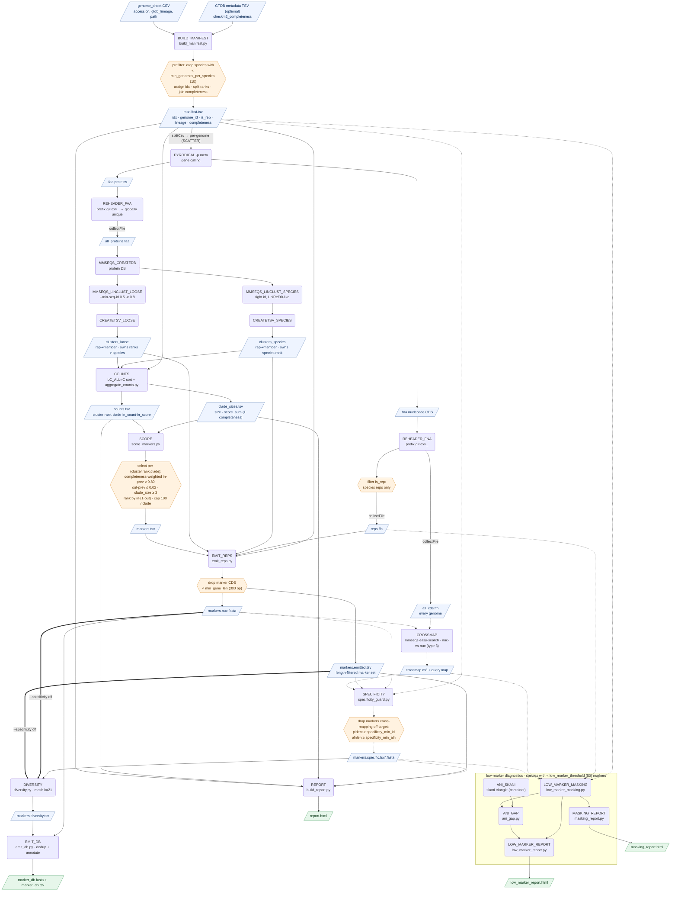

# meta-mage — pipeline flow

How the `markers` workflow ([workflows/markers.nf](../workflows/markers.nf)) turns genome
assemblies + GTDB lineages into a nucleotide **classifier marker database**.

Legend: **rounded** = process/tool · **hexagon** = filter/selector (drops or
subsets data) · **parallelogram** = data artifact · **green** = published output ·
dashed edges = the optional nucleotide specificity guard (`--specificity`).

A PDF of the *actual* run DAG is emitted every run at
`${outdir}/pipeline_info/pipeline_dag.pdf` (Nextflow + graphviz); the diagram below
is the curated illustration.

## Key idea

Clustering stays in **protein space** (homologs at higher ranks stay one family),
while the marker payload is **nucleotide, from species reps only**. Two clusterings
run over the same protein DB: a **loose** one scaffolds family-and-above, a **tight**
one owns the species rank so sister-species/paralogs stay apart. The only
genome-scale structure held in memory is the compact `idx → lineage` map; everything
else streams or is externally sorted (the 800k-genome-safe path).

**Completeness weighting** (when `--gtdb_metadata` is set): core prevalence is
`(N − Σ completeness of the genomes missing the gene) / N`, so a core gene absent
only because a genome is fragmentary is not demoted. With no metadata every genome
weighs 1.0 and this reduces to plain presence/N.

**Low-marker diagnostics**: any species that ends below `low_marker_threshold`
markers is examined for (1) whether its cross-map-dropped markers could be salvaged
by masking, and (2) whether it has a within-vs-between ANI gap in its genus (a
re-merge signal).

See [README.md](../README.md) for the stage table and parameter reference.
